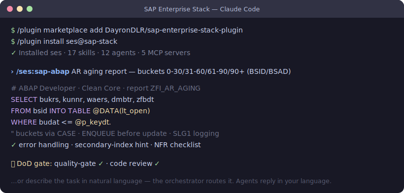

# SAP Enterprise Stack — Claude Code Plugin

[](LICENSE)



<sub>Illustrative example of `/ses:sap-abap` in action.</sub>

**English** · [Español](#sap-enterprise-stack--plugin-de-claude-code-español)

A complete SAP development stack inside Claude Code. Install the plugin and you
get **11 specialized SAP agents**, an **orchestrator** that routes in natural
language, support **subagents**, **SAP reference skills**, **quality gates
(Definition of Done)** and **5 SAP MCP servers** — without cloning any repo.

> 🌐 **The agents reply in your language.** Write your request in English → you
> get English; write in Spanish → Spanish. SAP terms and code stay untouched.

- **Development agents** (Opus): ABAP, CAP/BTP, Fiori/UI5, HANA, Integration.
- **Support agents** (Sonnet): Basis, Migration, QA, DevOps, Requirements, Docs.
- **Assumed landscape:** S/4HANA 2023 + BTP, DEV→QAS→PRD, Clean Core principles.

## License

**GPL-3.0** (see [`LICENSE`](LICENSE)). Free **copyleft** software: you may use,
modify and redistribute it, as long as your derivatives **stay GPL-3.0 and you
publish their source**. It cannot be closed-sourced or embedded in a proprietary
product.

It bundles compatible third-party components — full attributions in
[`NOTICE`](NOTICE):

| Component | Source | License |
| --- | --- | --- |
| 10 SAP reference skills | [`secondsky/sap-skills`](https://github.com/secondsky/sap-skills) | GPL-3.0 |
| `skill-creator` | Anthropic | Apache-2.0 |
| `sapui5-freestyle` | upstream | MIT |
| Everything else (agents, hooks, orchestrator, commands) | DayronDLR | GPL-3.0 |

## Requirement: pnpm

Everything Node-related uses **pnpm** (MCP servers run via `pnpm dlx`, and so do
the hook linters). Have it on your PATH:

```bash
corepack enable && corepack prepare pnpm@latest --activate   # or: brew install pnpm
```

## Install

```text
/plugin marketplace add DayronDLR/sap-enterprise-stack-plugin
/plugin install ses@sap-stack
/reload-plugins
```

Commands are namespaced under `ses:` — e.g. `/ses:sap-abap`.

## How to update

Update it like any Claude Code plugin:

```text
/plugin update
```

Every release publishes a new marketplace version automatically, so
`/plugin update` pulls the latest — **no re-cloning, no manual steps**. After
updating, run `/reload-plugins` to reload commands and hooks.

> Behind the scenes: every change to the stack rebuilds and re-publishes this
> repo (which is plugin **and** marketplace) with a bumped version — that's how
> `/plugin update` detects it.

## Getting started (2 minutes)

1. Install (the 3 commands above).
2. Type `/ses:` and autocomplete shows the 11 agents.
3. Try one:

   ```text
   /ses:sap-abap I need an AR aging report with 0-30/31-60/61-90/90+ buckets from BSID/BSAD
   ```

4. Or describe the task in natural language and let the orchestrator route it:

   ```text
   I need to design a sales Calculation View with currency conversion for SAC
   ```

## Usage — the 11 agents

| Command | Domain | Example |
| --- | --- | --- |
| `:sap-req` | Requirements, blueprints, FS, gap analysis | Procure-to-Pay process blueprint |
| `:sap-integration` | CPI, iFlows, OData, IDocs, APIs | Async SAP→Salesforce iFlow with retries |
| `:sap-cap` | CAP Node.js/Java, BTP, MTA, XSUAA | Expense-approval app with CAP + HANA Cloud |
| `:sap-fiori` | Fiori Elements, SAPUI5, RAP, BAS | List Report + Object Page for purchase orders |
| `:sap-hana` | Calculation Views, SQLScript, HDI | Sales CalcView with currency conversion |
| `:sap-abap` | ABAP, CDS, RAP, BAdIs, EML, AMDP | AR aging report with buckets and error handling |
| `:sap-basis` | Roles, authorizations, transports, SoD | Role design with SoD for FI display |
| `:sap-migration` | Data migration, LTMC, Migration Cockpit | Field mapping for a customer-master load |
| `:sap-qa` | Test cases, UAT, NFR, go-live | Test plan + NFR checklist for the aging report |
| `:sap-devops` | CI/CD, gCTS, ATC, pipelines | Transport pipeline with an ATC gate |
| `:sap-doc` | Technical docs, Word, full-stack | Technical document with architecture |

> All prefixed with `/ses:`. Also: `:sap-techlead` (plans multi-agent tasks) and
> the `reviewer` / `mentor` subagents (via `/agents` or keywords).

## What ships / becomes active on install

| Component | What it does | Invocation |
| --- | --- | --- |
| 11 agent commands | Self-contained SAP personas (persona + rules + NFR + Clean Core inline) | `/ses:sap-abap …` |
| Orchestrator (skill) | Routes your natural-language request to the right agent | automatic |
| Subagents | `reviewer` (code review), `mentor` (educational review), Fiori (architect/implementer/debugger/tester) | `/agents` or keywords |
| SAP reference skills | Technical material (ABAP, CDS, CAP, SQLScript, BTP, Fiori Tools, UI5) consulted on-demand | automatic |
| Definition of Done hooks | Quality gates on `Stop` (quality-gate + code review), sensitive-file protection, auto-lint | after `/reload-plugins` |
| 5 MCP servers | `sap-cap-capire`, `sap-ui5`, `sap-fiori-tools`, `github`, `sap-adt` | `mcp__…` tools |

## Prerequisites for full functionality (100%)

**Nothing extra is required to use the agents and skills** — with just Claude Code
and `pnpm` you get the 11 agents, orchestrator, subagents, all 17 skills and the
DoD hooks. The table maps the few capabilities that need one extra thing:

| Capability | Ready as-is? | To unlock it |
| --- | --- | --- |
| 11 agents · orchestrator · subagents · 17 SAP skills | ✅ | — |
| DoD quality gates + auto-lint | ✅ | **Windows:** Git Bash or WSL (hooks are bash). First lint downloads `@sap/cds-dk` / `@ui5/linter` / `eslint` via `pnpm dlx` → needs network |
| 4 MCP servers (CAP, UI5, Fiori Tools, GitHub) | ✅ | first use downloads the package via `pnpm dlx` (network); `GITHUB_TOKEN` raises GitHub rate limits |
| MCP `sap-adt` — read ABAP from a **live** system | ⚠️ creds | export `SAP_ADT_URL` / `SAP_ADT_USER` / `SAP_ADT_PASSWORD` / `SAP_ADT_CLIENT` |
| `/ses:sap-doc` — document **content** | ✅ | — |
| `/ses:sap-doc` — **Word/PPTX** output | ➕ add-on | `pandoc` 3.x + `python3` + `pip install python-pptx lxml` |
| `/ses:sap-doc` — **branded** build (theme + draw.io) | ➕ add-on | the [`sap-doc-toolkit`](https://github.com/DayronDLR/sap-doc-toolkit) companion (MIT) + your own SAP BTP icon set |
| Context optimization (autocompact, tool-search) | ➕ optional | env vars in your `settings.json` (see below) |

Legend: ✅ works out of the box · ⚠️ needs credentials · ➕ optional add-on.

## What you can / can't do

**You can:**

- Use the 11 agents in **any SAP project** without cloning the repo.
- Let the **orchestrator** route by natural language (no need to memorize commands).
- Run the **Definition of Done gates** automatically when closing tasks.
- Consult the **SAP reference skills** on-demand.
- Use the **5 MCP servers** (4 with no credentials; `sap-adt` needs credentials).
- **Update** with `/plugin update` and modify/fork it (under GPL-3.0).

**You can't (by design or plugin limits):**

- Invoke commands **without the `ses:` prefix** — plugin namespacing is mandatory
  in Claude Code (there is no bare `/sap-abap`).
- **Develop or regenerate the stack** itself (the generator, tests and CI live in
  the development repo, not in the plugin).
- The **branded documentation build** (`.docx`/`.pptx` with a client theme +
  diagrams with SAP BTP icons) — not distributed (the icons are proprietary SAP
  assets). `sap-doc` still produces the doc **content**.
- Have the plugin **set env vars** for you (a plugin can't ship `env`) — you set
  them manually (see below).
- **Relicense** under a non-GPL license — it's copyleft.

## Quality gates (Definition of Done) — important

This plugin is **opinionated**: it installs hooks that enforce a *Definition of
Done*. It's intentional (it comes from an enterprise workflow), but you should
know before installing:

| Event | What it does | Can it block? |
| --- | --- | --- |
| `Stop` (closing a task) | Runs **quality-gate** (linters/smells) + **code review** on the diff | **Yes** — CRITICAL/HIGH findings ask you to keep working before closing |
| `PreToolUse` | **Protects sensitive files** (`.env`, `xs-security.json`, …) | Yes — blocks editing them |
| `PostToolUse` | Auto-lints CDS/UI5/manifests on edit | No (informative) |

**Don't want them?** Set this in your `settings.json` (opt-out, plugin only):

```json
{ "env": { "SES_SKIP_DOD_GATES": "1" } }
```

That **skips** the `Stop` gates so you can close without a review. Agents, skills
and MCP keep working. (Sensitive-file protection and auto-lint don't depend on
this variable.)

> The hooks are **bash** scripts — on Windows you need Git Bash or WSL.

## User configuration

1. **MCP `sap-adt`** (reads ABAP from the live system) needs credentials:

   ```bash
   export SAP_ADT_URL="https://your-system:44300"
   export SAP_ADT_USER="..." SAP_ADT_PASSWORD="..." SAP_ADT_CLIENT="100"
   ```

   The other 4 MCP (CAP, UI5, Fiori Tools, GitHub) start with no secrets.

2. **Context optimization (optional)** — a plugin can't ship `env`; if you want
   it, add to YOUR `settings.json`:

   ```json
   { "env": { "CLAUDE_AUTOCOMPACT_PCT_OVERRIDE": "60", "ENABLE_TOOL_SEARCH": "auto:5", "MAX_MCP_OUTPUT_TOKENS": "50000" } }
   ```

3. **First use of each MCP downloads its package** (`pnpm dlx`, needs network).

## SAP reference skills (included)

This plugin **includes** the SAP reference skills (ABAP, CDS, CAP, SQLScript,
BTP, Fiori Tools, UI5 syntax, …) — material the agents consult on-demand. They
come from the upstream project
[`secondsky/sap-skills`](https://github.com/secondsky/sap-skills) under
**GPL-3.0**; that's why the whole plugin is distributed under **GPL-3.0**. See
`NOTICE` for full attributions.

## Inputs & documentation (`sap-doc` agent)

`/ses:sap-doc` produces SAP technical documentation. Since a plugin is
**read-only**, its inputs live in **YOUR project**, not in the plugin — the agent
reads them via `${CLAUDE_PROJECT_DIR}`.

**Client data (you place it, in your project):**

```text
your-project/
└── docs/architecture/
    ├── client-theme.yaml     # client palette, fonts, logos
    ├── reference.docx        # Word template for pandoc --reference-doc
    └── …                     # client structure/template
```

> Never push client data to a public repo. Keep it in your (private) project.

**Branded build (`.docx`/`.pptx` with theme + draw.io diagrams):** `/ses:sap-doc`
produces the doc **content**; the branded-build toolchain (draw.io generator,
`build-doc.sh`, `build-pptx.py`, theming) ships as a separate **MIT companion**:
**[`sap-doc-toolkit`](https://github.com/DayronDLR/sap-doc-toolkit)**. The **SAP BTP
icon library** is **not** included (proprietary SAP assets) — you provide your own;
the generator degrades gracefully without it.

## ☕ Support the project

Built and maintained on personal time — free and open source. If it saves you
time, you can send a coffee (or a beer 🍺):

[](https://buymeacoffee.com/dayrondlr)
[](https://paypal.me/dlrdayron)

You can also just ⭐ the repo — it helps a lot. Thank you! 🙌

## Support

Issues and improvements: <https://github.com/DayronDLR/sap-enterprise-stack-plugin/issues>

---

<a name="sap-enterprise-stack--plugin-de-claude-code-español"></a>

## SAP Enterprise Stack — Plugin de Claude Code (Español)

[English](#sap-enterprise-stack--claude-code-plugin) · **Español**

Un stack completo de desarrollo SAP dentro de Claude Code. Instalas el plugin y
tienes **11 agentes SAP especializados**, un **orquestador** que enruta por
lenguaje natural, **subagentes** de apoyo, **skills SAP de referencia**, **gates
de calidad (Definition of Done)** y **5 MCP servers SAP** — sin clonar ningún
repo.

> 🌐 **Los agentes responden en tu idioma.** Escribes en español → respondes en
> español; en inglés → inglés. Los términos SAP y el código quedan intactos.

- **Agentes de desarrollo** (Opus): ABAP, CAP/BTP, Fiori/UI5, HANA, Integration.
- **Agentes de soporte** (Sonnet): Basis, Migration, QA, DevOps, Requirements, Docs.
- **Entorno asumido:** S/4HANA 2023 + BTP, landscape DEV→QAS→PRD, Clean Core.

## Licencia

**GPL-3.0** (ver [`LICENSE`](LICENSE)). Es software libre **copyleft**: puedes
usarlo, modificarlo y redistribuirlo, siempre que tus derivados **se mantengan
bajo GPL-3.0 y publiques su código fuente**. No se puede cerrar ni integrar en un
producto propietario.

Incluye componentes de terceros compatibles — atribuciones completas en
[`NOTICE`](NOTICE):

| Componente | Origen | Licencia |
| --- | --- | --- |
| 10 skills SAP de referencia | [`secondsky/sap-skills`](https://github.com/secondsky/sap-skills) | GPL-3.0 |
| `skill-creator` | Anthropic | Apache-2.0 |
| `sapui5-freestyle` | upstream | MIT |
| Todo lo demás (agentes, hooks, orquestador, comandos) | DayronDLR | GPL-3.0 |

## Requisito: pnpm

Todo lo de Node usa **pnpm** (los MCP corren con `pnpm dlx`, los linters de hooks
también). Tenlo en el PATH:

```bash
corepack enable && corepack prepare pnpm@latest --activate   # o: brew install pnpm
```

## Instalación

```text
/plugin marketplace add DayronDLR/sap-enterprise-stack-plugin
/plugin install ses@sap-stack
/reload-plugins
```

Los comandos quedan namespaced bajo `ses:` — p.ej. `/ses:sap-abap`.

## Cómo actualizar

El plugin se actualiza como cualquier plugin de Claude Code:

```text
/plugin update
```

Cada release publica una versión nueva del marketplace automáticamente, así que
`/plugin update` te trae lo último — **sin re-clonar ni pasos manuales**. Después
de actualizar, corre `/reload-plugins` para recargar comandos y hooks.

## Uso — los 11 agentes

| Comando | Dominio | Ejemplo |
| --- | --- | --- |
| `:sap-req` | Requirements, blueprints, FS, gap analysis | Blueprint del proceso Procure-to-Pay |
| `:sap-integration` | CPI, iFlows, OData, IDocs, APIs | iFlow asíncrono SAP→Salesforce con reintentos |
| `:sap-cap` | CAP Node.js/Java, BTP, MTA, XSUAA | App de aprobaciones de gastos con CAP + HANA Cloud |
| `:sap-fiori` | Fiori Elements, SAPUI5, RAP, BAS | List Report + Object Page de órdenes de compra |
| `:sap-hana` | Calculation Views, SQLScript, HDI | CalcView de ventas con conversión de moneda |
| `:sap-abap` | ABAP, CDS, RAP, BAdIs, EML, AMDP | Report de aging AR con buckets y manejo de errores |
| `:sap-basis` | Roles, autorizaciones, transportes, SoD | Diseño de rol con SoD para FI display |
| `:sap-migration` | Migración de datos, LTMC, Migration Cockpit | Mapeo de campos para carga de maestro de clientes |
| `:sap-qa` | Casos de prueba, UAT, NFR, go-live | Plan de pruebas + checklist NFR para el report de aging |
| `:sap-devops` | CI/CD, gCTS, ATC, pipelines | Pipeline de transporte con gate de ATC |
| `:sap-doc` | Documentación técnica, Word, full-stack | Documento técnico del proyecto con arquitectura |

> Todos prefijados con `/ses:`. Además: `:sap-techlead` y los subagentes
> `reviewer` / `mentor` (vía `/agents` o por palabras clave).

## Qué puedes / Qué NO

**Podés:** usar los 11 agentes en cualquier proyecto SAP sin clonar; dejar que el
orquestador enrute por lenguaje natural; correr los gates de DoD; consultar las
skills; usar los 5 MCP; actualizar con `/plugin update` y forkear (bajo GPL-3.0).

**No puedes:** invocar comandos sin el prefijo `ses:` (namespacing obligatorio);
desarrollar/regenerar el stack desde el plugin; el build branded de docs con
iconos SAP (no se distribuye); que el plugin configure `env` por ti; relicenciar
fuera de GPL.

## Gates de calidad (Definition of Done)

El plugin instala hooks que aplican una *Definition of Done*: en `Stop` corre
quality-gate + code review (**puede bloquear** el cierre si hay CRITICAL/HIGH),
`PreToolUse` protege archivos sensibles, `PostToolUse` auto-lint. Para
desactivar los gates de `Stop`, pon en tu `settings.json`:

```json
{ "env": { "SES_SKIP_DOD_GATES": "1" } }
```

Los hooks son scripts **bash** — en Windows necesitas Git Bash o WSL.

## Requisitos para funcionar al 100%

**No necesitas nada extra para usar los agentes y skills** — con Claude Code +
`pnpm` ya tienes los 11 agentes, orquestador, subagentes, las 17 skills y los hooks
de DoD. Los extras solo habilitan capacidades puntuales:

| Capacidad | ¿Lista? | Para habilitarla |
| --- | --- | --- |
| Agentes · orquestador · subagentes · 17 skills | ✅ | — |
| Gates de DoD + auto-lint | ✅ | **Windows:** Git Bash/WSL; el 1er lint baja `@sap/cds-dk` / `@ui5/linter` / `eslint` vía `pnpm dlx` (red) |
| 4 MCP (CAP, UI5, Fiori Tools, GitHub) | ✅ | 1er uso baja el paquete (red); `GITHUB_TOKEN` sube el rate limit |
| MCP `sap-adt` (ABAP del sistema **real**) | ⚠️ creds | `SAP_ADT_URL` / `SAP_ADT_USER` / `SAP_ADT_PASSWORD` / `SAP_ADT_CLIENT` |
| `/ses:sap-doc` — **contenido** | ✅ | — |
| `/ses:sap-doc` — salida **Word/PPTX** | ➕ | `pandoc` + `python3` + `pip install python-pptx lxml` |
| `/ses:sap-doc` — build **branded** | ➕ | companion [`sap-doc-toolkit`](https://github.com/DayronDLR/sap-doc-toolkit) + tus iconos SAP |
| Optimización de contexto | ➕ | env vars en tu `settings.json` |

## Configuración que requiere acción

1. **MCP `sap-adt`** necesita credenciales (`SAP_ADT_URL/USER/PASSWORD/CLIENT`);
   los otros 4 MCP arrancan sin secrets.
2. **Env de optimización de contexto (opcional)** — se ponen a mano en tu
   `settings.json` (un plugin no puede shippear `env`).
3. Primer uso de cada MCP descarga su paquete (`pnpm dlx`, requiere red).

## Insumos y documentación (`sap-doc`)

Los insumos del cliente (tema, `reference.docx`, plantillas) van en **tu
proyecto** (`docs/architecture/…`), no en el plugin. `sap-doc` genera el
**contenido**; el toolchain de build branded es un **companion MIT**:
**[`sap-doc-toolkit`](https://github.com/DayronDLR/sap-doc-toolkit)** (los iconos
SAP BTP no van — assets propietarios de SAP, los pones tú).

## ☕ Apoya el proyecto

Hecho y mantenido en tiempo personal — gratis y open source. Si te ahorra tiempo,
puedes invitarme un café (o una cerveza 🍺):

[](https://buymeacoffee.com/dayrondlr)
[](https://paypal.me/dlrdayron)

También puedes darle una ⭐ al repo — ayuda un montón. ¡Gracias! 🙌

## Soporte

Issues y mejoras: <https://github.com/DayronDLR/sap-enterprise-stack-plugin/issues>
