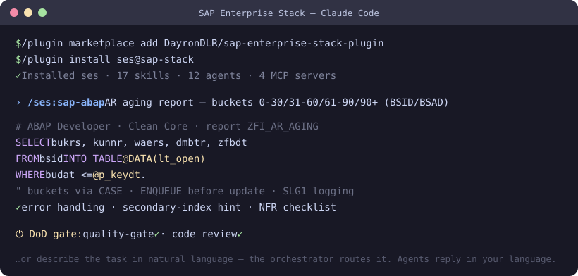

# SAP Enterprise Stack — Claude Code Plugin

[](LICENSE)



<sub>Illustrative example of `/ses:sap-abap` in action.</sub>

**English** · [Español](#sap-enterprise-stack--plugin-de-claude-code-español)

A complete SAP development stack inside Claude Code. Install the plugin and you
get **11 specialized SAP agents**, an **orchestrator** that routes in natural
language, support **subagents**, **SAP reference skills**, **quality gates
(Definition of Done)** and **4 SAP MCP servers** — without cloning any repo.

> 🌐 **The agents reply in your language.** Write your request in English → you
> get English; write in Spanish → Spanish. SAP terms and code stay untouched.

- **Development agents** (Opus): ABAP, CAP/BTP, Fiori/UI5, HANA, Integration.
- **Support agents** (Sonnet): Basis, Migration, QA, DevOps, Requirements, Docs.
- **Assumed landscape:** S/4HANA 2023 + BTP, DEV→QAS→PRD, Clean Core principles.

## License

**GPL-3.0** (see [`LICENSE`](LICENSE)). Free **copyleft** software: you may use,
modify and redistribute it, as long as your derivatives **stay GPL-3.0 and you
publish their source**. It cannot be closed-sourced or embedded in a proprietary
product.

It bundles compatible third-party components — full attributions in
[`NOTICE`](NOTICE):

| Component | Source | License |
| --- | --- | --- |
| 10 SAP reference skills | [`secondsky/sap-skills`](https://github.com/secondsky/sap-skills) | GPL-3.0 |
| `skill-creator` | Anthropic | Apache-2.0 |
| `sapui5-freestyle` | upstream | MIT |
| Everything else (agents, hooks, orchestrator, commands) | DayronDLR | GPL-3.0 |

## Requirement: Node.js only (no pnpm)

The plugin needs just **Node.js** — its MCP servers run via `npx`, which ships with
Node/npm and is already present in SAP Business Application Studio, Cloud Foundry and
any Node dev environment. **Nothing else to install** (no pnpm, no global packages).

> The plugin **imposes no package manager anywhere.** Its own MCP servers use `npx`
> (universally available). The DoD auto-lint hooks use **only your** project's own
> linter (`node_modules/.bin`, created by npm/yarn/pnpm alike) and skip silently if it
> isn't installed — nothing is downloaded, no global tool is run against your project,
> and your package manager is left untouched.

## Install

```text
/plugin marketplace add DayronDLR/sap-enterprise-stack-plugin
/plugin install ses@sap-stack
/reload-plugins
```

Commands are namespaced under `ses:` — e.g. `/ses:sap-abap`.

## How to update

Update it like any Claude Code plugin:

```text
/plugin update
```

Every release publishes a new marketplace version automatically, so
`/plugin update` pulls the latest — **no re-cloning, no manual steps**. After
updating, run `/reload-plugins` to reload commands and hooks.

> Behind the scenes: every change to the stack rebuilds and re-publishes this
> repo (which is plugin **and** marketplace) with a bumped version — that's how
> `/plugin update` detects it.

## Other editors

This marketplace ships the **Claude Code** plugin. The same stack — same agents,
commands, skills, MCP servers and Definition of Done — also runs on:

| Editor | Gates while you type |
| --- | --- |
| **Claude Code** | all 8 hooks, automatic *(this plugin)* |
| **Codex CLI** | all 8, once you trust the project folder |
| **OpenCode** | 5 of 8 — the other 3 use events OpenCode doesn't expose |
| **GitHub Copilot** | none; the gates live in git hooks and CI |

### Codex CLI — install and update

On Codex the stack comes in **two independent parts**:

| Part | What it brings | Installed with |
| --- | --- | --- |
| **Plugin** | 51 skills: 20 commands (`$ses-sap-abap`…), 6 subagents, 25 reference skills | `codex plugin …` — once per machine |
| **Project bundle** | the Definition of Done hooks, the 4 SAP MCP servers (`sap-adt` included) and `AGENTS.md` with the SAP context | `instalar.sh` — once per project |

A Codex plugin cannot carry hooks or MCP servers (verified against `codex-cli
0.153.4`: `plugin_hooks` is `removed`), which is why the bundle exists.

**First time**

```bash
# 1. Plugin — register the marketplace, then install (both are needed)
codex plugin marketplace add DayronDLR/sap-enterprise-stack-plugin
codex plugin add ses@sap-stack

# 2. Bundle — from a clone of this repo
git clone https://github.com/DayronDLR/sap-enterprise-stack-plugin
cd sap-enterprise-stack-plugin
./instalar.sh codex ~/my-sap-project
```

**3.** Open `codex` in the project, **trust the folder** when it asks, and **approve
the hooks in `/hooks`**. Until you do both, no hook runs: the gates stay in git
and CI.

`instalar.sh` also installs the bundle for the other hosts:
`./instalar.sh opencode <project>` or `./instalar.sh copilot <project>`.

**Update**

```bash
# 1. Plugin — `upgrade` refreshes the marketplace; `add` installs the new version
codex plugin marketplace upgrade
codex plugin add ses@sap-stack

# 2. Bundle — bring the new version and let it replace the old one
cd sap-enterprise-stack-plugin && git pull
./instalar.sh codex ~/my-sap-project --force
```

**3.** Open `codex` in the project and **approve the hooks again in `/hooks`**: every
changed hook goes back to «Hooks need review» and does not run until approved.

**If something fails**

| Message or symptom | Cause | Fix |
| --- | --- | --- |
| ``plugin `ses` was not found in marketplace `sap-stack` `` | The `sap-stack` marketplace was never added on this machine (`upgrade` only refreshes the ones you already have) | `codex plugin marketplace add DayronDLR/sap-enterprise-stack-plugin`, then `codex plugin add ses@sap-stack` |
| `upgrade` says «Upgraded» but the skills are the old ones | `upgrade` does not reinstall the plugin | `codex plugin add ses@sap-stack` |
| `instalar.sh` stops: «N file(s) differ from the bundle» | Files from a previous bundle, or edits of yours | Review the list; if the bundle should win, repeat with `--force` |
| The gates do not stop a delivery | Folder not trusted, or hooks not approved | Open `codex` in the project and approve in `/hooks` |

**Windows.** The plugin installs the same way from PowerShell (`codex.cmd plugin
…`). The bundle's hooks and `sap-adt` run with `sh`/`bash`: run `instalar.sh` from
Git Bash, and use Codex from WSL or Git Bash. Native PowerShell is not verified
for the hooks or `sap-adt`.

## Getting started (2 minutes)

1. Install (the 3 commands above).
2. Type `/ses:` and autocomplete shows the 11 agents.
3. Try one:

   ```text
   /ses:sap-abap I need an AR aging report with 0-30/31-60/61-90/90+ buckets from BSID/BSAD
   ```

4. Or describe the task in natural language and let the orchestrator route it:

   ```text
   I need to design a sales Calculation View with currency conversion for SAC
   ```

## Usage — the 11 agents

| Command | Domain | Example |
| --- | --- | --- |
| `:sap-req` | Requirements, blueprints, FS, gap analysis | Procure-to-Pay process blueprint |
| `:sap-integration` | CPI, iFlows, OData, IDocs, APIs | Async SAP→Salesforce iFlow with retries |
| `:sap-cap` | CAP Node.js/Java, BTP, MTA, XSUAA | Expense-approval app with CAP + HANA Cloud |
| `:sap-fiori` | Fiori Elements, SAPUI5, RAP, BAS | List Report + Object Page for purchase orders |
| `:sap-hana` | Calculation Views, SQLScript, HDI | Sales CalcView with currency conversion |
| `:sap-abap` | ABAP, CDS, RAP, BAdIs, EML, AMDP | AR aging report with buckets and error handling |
| `:sap-basis` | Roles, authorizations, transports, SoD | Role design with SoD for FI display |
| `:sap-migration` | Data migration, LTMC, Migration Cockpit | Field mapping for a customer-master load |
| `:sap-qa` | Test cases, UAT, NFR, go-live | Test plan + NFR checklist for the aging report |
| `:sap-devops` | CI/CD, gCTS, ATC, pipelines | Transport pipeline with an ATC gate |
| `:sap-doc` | Technical docs, Word, full-stack | Technical document with architecture |

> All prefixed with `/ses:`. Also: `:sap-techlead` (plans multi-agent tasks) and
> the `reviewer` / `mentor` subagents (via `/agents` or keywords).

## What ships / becomes active on install

| Component | What it does | Invocation |
| --- | --- | --- |
| 11 agent commands | Self-contained SAP personas (persona + rules + NFR + Clean Core inline) | `/ses:sap-abap …` |
| Orchestrator (skill) | Routes your natural-language request to the right agent | automatic |
| Subagents | `reviewer` (code review), `mentor` (educational review), Fiori (architect/implementer/debugger/tester) | `/agents` or keywords |
| SAP reference skills | Technical material (ABAP, CDS, CAP, SQLScript, BTP, Fiori Tools, UI5) consulted on-demand | automatic |
| Definition of Done hooks | Quality gates on `Stop` (quality-gate + code review), sensitive-file protection, auto-lint | after `/reload-plugins` |
| 4 MCP servers | `sap-cap-capire`, `sap-ui5`, `sap-fiori-tools`, `sap-adt` | `mcp__…` tools |

## Prerequisites for full functionality (100%)

**Nothing extra is required to use the agents and skills** — with just Claude Code
and Node.js you get the 11 agents, orchestrator, subagents, all 17 skills and the
DoD hooks. The table maps the few capabilities that need one extra thing:

| Capability | Ready as-is? | To unlock it |
| --- | --- | --- |
| 11 agents · orchestrator · subagents · 17 SAP skills | ✅ | — |
| DoD quality gates + auto-lint | ✅ | **Windows:** Git Bash or WSL (hooks are bash). Auto-lint uses **only** your project's own `cds` / `ui5lint` / `eslint` (`node_modules/.bin`) and skips if not installed — no download, no global tool, no imposed package manager |
| 3 MCP servers (CAP, UI5, Fiori Tools) | ✅ | first use downloads the package via `npx` (network, needs only Node) |
| MCP `sap-adt` — read ABAP from a **live** system | ⚠️ creds | a connection `.env` outside the repo + `export SAP_ADT_ENV_PATH=<path>` |
| `/ses:sap-doc` — document **content** | ✅ | — |
| `/ses:sap-doc` — **Word/PPTX** output | ➕ add-on | `pandoc` 3.x + `python3` + `pip install python-pptx lxml` |
| `/ses:sap-doc` — **branded** build (theme + draw.io) | ➕ add-on | the [`sap-doc-toolkit`](https://github.com/DayronDLR/sap-doc-toolkit) companion (MIT) + your own SAP BTP icon set |
| Context optimization (autocompact, tool-search) | ➕ optional | env vars in your `settings.json` (see below) |

Legend: ✅ works out of the box · ⚠️ needs credentials · ➕ optional add-on.

## What you can / can't do

**You can:**

- Use the 11 agents in **any SAP project** without cloning the repo.
- Let the **orchestrator** route by natural language (no need to memorize commands).
- Run the **Definition of Done gates** automatically when closing tasks.
- Consult the **SAP reference skills** on-demand.
- Use the **4 MCP servers** (3 with no credentials; `sap-adt` needs credentials).
- **Update** with `/plugin update` and modify/fork it (under GPL-3.0).

**You can't (by design or plugin limits):**

- Invoke commands **without the `ses:` prefix** — plugin namespacing is mandatory
  in Claude Code (there is no bare `/sap-abap`).
- **Develop or regenerate the stack** itself (the generator, tests and CI live in
  the development repo, not in the plugin).
- The **branded documentation build** (`.docx`/`.pptx` with a client theme +
  diagrams with SAP BTP icons) — not distributed (the icons are proprietary SAP
  assets). `sap-doc` still produces the doc **content**.
- Have the plugin **set env vars** for you (a plugin can't ship `env`) — you set
  them manually (see below).
- **Relicense** under a non-GPL license — it's copyleft.

## Quality gates (Definition of Done) — important

This plugin is **opinionated**: it installs hooks that enforce a *Definition of
Done*. It's intentional (it comes from an enterprise workflow), but you should
know before installing:

| Event | What it does | Can it block? |
| --- | --- | --- |
| `Stop` (closing a task) | Runs **quality-gate** (linters/smells) + **code review** on the diff | **Yes** — CRITICAL/HIGH findings ask you to keep working before closing |
| `PreToolUse` | **Protects sensitive files** (`.env`, `xs-security.json`, …) | Yes — blocks editing them |
| `PostToolUse` | Auto-lints CDS/UI5/manifests on edit | No (informative) |

**Don't want them?** Set this in your `settings.json` (opt-out, plugin only):

```json
{ "env": { "SES_SKIP_DOD_GATES": "1" } }
```

That **skips** the `Stop` gates so you can close without a review. Agents, skills
and MCP keep working. (Sensitive-file protection and auto-lint don't depend on
this variable.)

> The hooks are **bash** scripts — on Windows you need Git Bash or WSL.

## User configuration

1. **MCP `sap-adt`** (reads ABAP from the live system) needs credentials:

   ```bash
   # ~/.config/sap-adt/dev.env — outside any repo, chmod 600
   # SAP_URL=https://your-system:44300
   # SAP_CLIENT=100
   # SAP_AUTH_TYPE=basic
   # SAP_USERNAME=...
   # SAP_PASSWORD=...
   export SAP_ADT_ENV_PATH="$HOME/.config/sap-adt/dev.env"
   ```

   Over stdio the server reads its connection **only** from that file; without
   `SAP_ADT_ENV_PATH` it lists its tools and connects to nothing.

   The other 3 MCP (CAP, UI5, Fiori Tools) start with no secrets.

2. **Context optimization (recommended)** — a plugin can't ship `env`, so these
   have to go in YOUR `settings.json`:

   ```json
   { "env": { "CLAUDE_AUTOCOMPACT_PCT_OVERRIDE": "82", "MAX_MCP_OUTPUT_TOKENS": "8000" } }
   ```

   Measured on this plugin's MCP servers (205 tools):

   | Tool search | Cost per request |
   | --- | --- |
   | on (the default — leave `ENABLE_TOOL_SEARCH` **unset**) | **1.3k tokens** |
   | off (`ENABLE_TOOL_SEARCH=false`, a proxy `ANTHROPIC_BASE_URL`, or a pre-4.5 model) | **45.4k tokens** |

   Optional context guards shipped with the plugin (all on by default, each
   with an off switch):

   | Hook | What it does | Disable with |
   | --- | --- | --- |
   | `shrink-input.sh` | Bounds noisy commands (`git diff`, test runs, builds) before they run | `SES_SHRINK=off` |
   | `mcp-guard.sh` | Applies a default row/result cap to MCP calls that don't declare one | `SES_MCP_GUARD=off` |
   | `delivery-gate.sh` | Runs the Definition of Done at `git commit`/`push`/PR | `SES_GATES=off` |

   `SES_MODE=lite\|full\|ultra` grades how much the stack demands: `lite` runs
   Gate 1 only (for spikes), `full` is the default, `ultra` is for code headed
   to production.

   Don't set `ENABLE_TOOL_SEARCH` to `auto:N`: that's threshold mode, which
   loads the schemas upfront while they stay under N% of the context window.
   Unset always defers.

3. **First use of each MCP downloads its package** (`npx`, needs network + Node).

## SAP reference skills (included)

This plugin **includes** the SAP reference skills (ABAP, CDS, CAP, SQLScript,
BTP, Fiori Tools, UI5 syntax, …) — material the agents consult on-demand. They
come from the upstream project
[`secondsky/sap-skills`](https://github.com/secondsky/sap-skills) under
**GPL-3.0**; that's why the whole plugin is distributed under **GPL-3.0**. See
`NOTICE` for full attributions.

## Inputs & documentation (`sap-doc` agent)

`/ses:sap-doc` produces SAP technical documentation. Since a plugin is
**read-only**, its inputs live in **YOUR project**, not in the plugin — the agent
reads them via `${CLAUDE_PROJECT_DIR}`.

**Client data (you place it, in your project):**

```text
your-project/
└── docs/architecture/
    ├── client-theme.yaml     # client palette, fonts, logos
    ├── reference.docx        # Word template for pandoc --reference-doc
    └── …                     # client structure/template
```

> Never push client data to a public repo. Keep it in your (private) project.

**Branded build (`.docx`/`.pptx` with theme + draw.io diagrams):** `/ses:sap-doc`
produces the doc **content**; the branded-build toolchain (draw.io generator,
`build-doc.sh`, `build-pptx.py`, theming) ships as a separate **MIT companion**:
**[`sap-doc-toolkit`](https://github.com/DayronDLR/sap-doc-toolkit)**. The **SAP BTP
icon library** is **not** included (proprietary SAP assets) — you provide your own;
the generator degrades gracefully without it.

## ☕ Support the project

Built and maintained on personal time — free and open source. If it saves you
time, you can send a coffee (or a beer 🍺):

[](https://buymeacoffee.com/dayrondlr)
[](https://paypal.me/dlrdayron)

You can also just ⭐ the repo — it helps a lot. Thank you! 🙌

## Support

Issues and improvements: <https://github.com/DayronDLR/sap-enterprise-stack-plugin/issues>

---

<a name="sap-enterprise-stack--plugin-de-claude-code-español"></a>

## SAP Enterprise Stack — Plugin de Claude Code (Español)

[English](#sap-enterprise-stack--claude-code-plugin) · **Español**

Un stack completo de desarrollo SAP dentro de Claude Code. Instalas el plugin y
tienes **11 agentes SAP especializados**, un **orquestador** que enruta por
lenguaje natural, **subagentes** de apoyo, **skills SAP de referencia**, **gates
de calidad (Definition of Done)** y **4 MCP servers SAP** — sin clonar ningún
repo.

> 🌐 **Los agentes responden en tu idioma.** Escribes en español → respondes en
> español; en inglés → inglés. Los términos SAP y el código quedan intactos.

- **Agentes de desarrollo** (Opus): ABAP, CAP/BTP, Fiori/UI5, HANA, Integration.
- **Agentes de soporte** (Sonnet): Basis, Migration, QA, DevOps, Requirements, Docs.
- **Entorno asumido:** S/4HANA 2023 + BTP, landscape DEV→QAS→PRD, Clean Core.

## Otros editores

Este marketplace publica el plugin de **Claude Code**. El mismo stack —los mismos
agentes, comandos, skills, servidores MCP y Definition of Done— también corre en:

| Editor | Gates mientras escribís |
| --- | --- |
| **Claude Code** | los 8 hooks, automáticos *(este plugin)* |
| **Codex CLI** | los 8, una vez que confiás la carpeta del proyecto |
| **OpenCode** | 5 de 8 — los otros 3 usan eventos que OpenCode no expone |
| **GitHub Copilot** | ninguno; los gates viven en los hooks de git y en CI |

### Codex CLI — instalar y actualizar

En Codex el stack viene en **dos partes independientes**:

| Parte | Qué trae | Se instala con |
| --- | --- | --- |
| **Plugin** | 51 skills: los 20 comandos (`$ses-sap-abap`…), 6 subagentes y 25 skills de referencia | `codex plugin …` — una vez por máquina |
| **Bundle del proyecto** | los hooks de la Definition of Done, los 4 servidores MCP SAP (`sap-adt` incluido) y `AGENTS.md` con el contexto SAP | `instalar.sh` — una vez por proyecto |

Un plugin de Codex no puede llevar hooks ni servidores MCP (verificado contra
`codex-cli 0.153.4`: `plugin_hooks` está `removed`); por eso existe el bundle.

**Primera vez**

```bash
# 1. Plugin — registrar el marketplace y después instalar (hacen falta los dos)
codex plugin marketplace add DayronDLR/sap-enterprise-stack-plugin
codex plugin add ses@sap-stack

# 2. Bundle — desde un clone de este repo
git clone https://github.com/DayronDLR/sap-enterprise-stack-plugin
cd sap-enterprise-stack-plugin
./instalar.sh codex ~/mi-proyecto-sap
```

**3.** Abrí `codex` en el proyecto, **confiá en la carpeta** cuando te pregunte y
**aprobá los hooks en `/hooks`**. Hasta hacer las dos cosas no corre ningún
hook: los gates quedan en git y CI.

`instalar.sh` también instala el bundle de los otros hosts:
`./instalar.sh opencode <proyecto>` o `./instalar.sh copilot <proyecto>`.

**Actualizar**

```bash
# 1. Plugin — `upgrade` refresca el marketplace; `add` instala la versión nueva
codex plugin marketplace upgrade
codex plugin add ses@sap-stack

# 2. Bundle — traer la versión nueva y que reemplace a la vieja
cd sap-enterprise-stack-plugin && git pull
./instalar.sh codex ~/mi-proyecto-sap --force
```

**3.** Abrí `codex` en el proyecto y **aprobá de nuevo los hooks en `/hooks`**: cada
hook que cambió vuelve a «Hooks need review» y no corre hasta aprobarlo.

**Si algo falla**

| Mensaje o síntoma | Causa | Arreglo |
| --- | --- | --- |
| ``plugin `ses` was not found in marketplace `sap-stack` `` | El marketplace `sap-stack` nunca se agregó en esta máquina (`upgrade` sólo refresca los que ya tenés) | `codex plugin marketplace add DayronDLR/sap-enterprise-stack-plugin` y después `codex plugin add ses@sap-stack` |
| `upgrade` dice «Upgraded» pero los skills son los viejos | `upgrade` no reinstala el plugin | `codex plugin add ses@sap-stack` |
| `instalar.sh` se detiene: «N archivo(s) difieren del bundle» | Archivos de un bundle anterior, o cambios tuyos | Revisá la lista; si el bundle debe ganar, repetí con `--force` |
| Los gates no frenan una entrega | Carpeta sin confiar, o hooks sin aprobar | Abrí `codex` en el proyecto y aprobalos en `/hooks` |

**Windows.** El plugin se instala igual desde PowerShell (`codex.cmd plugin …`).
Los hooks del bundle y `sap-adt` corren con `sh`/`bash`: ejecutá `instalar.sh`
desde Git Bash, y usá Codex desde WSL o Git Bash. En PowerShell nativo los hooks y
`sap-adt` no están verificados.

## Licencia

**GPL-3.0** (ver [`LICENSE`](LICENSE)). Es software libre **copyleft**: puedes
usarlo, modificarlo y redistribuirlo, siempre que tus derivados **se mantengan
bajo GPL-3.0 y publiques su código fuente**. No se puede cerrar ni integrar en un
producto propietario.

Incluye componentes de terceros compatibles — atribuciones completas en
[`NOTICE`](NOTICE):

| Componente | Origen | Licencia |
| --- | --- | --- |
| 10 skills SAP de referencia | [`secondsky/sap-skills`](https://github.com/secondsky/sap-skills) | GPL-3.0 |
| `skill-creator` | Anthropic | Apache-2.0 |
| `sapui5-freestyle` | upstream | MIT |
| Todo lo demás (agentes, hooks, orquestador, comandos) | DayronDLR | GPL-3.0 |

## Requisito: solo Node.js (sin pnpm)

El plugin necesita solo **Node.js** — sus MCP servers corren con `npx`, que viene con
Node/npm y ya está presente en SAP Business Application Studio, Cloud Foundry y
cualquier entorno Node. **Nada más que instalar** (ni pnpm, ni paquetes globales).

> El plugin **no impone ningún package manager, en ningún lado.** Sus propios MCP
> servers usan `npx` (universalmente disponible). Los hooks de auto-lint de la DoD usan
> **solo** el linter de **tu** proyecto (`node_modules/.bin`, que crean npm/yarn/pnpm
> por igual) y se omiten sin ruido si no está instalado — no descargan nada, no corren
> una herramienta global contra tu proyecto, ni tocan tu gestor.

## Instalación

```text
/plugin marketplace add DayronDLR/sap-enterprise-stack-plugin
/plugin install ses@sap-stack
/reload-plugins
```

Los comandos quedan namespaced bajo `ses:` — p.ej. `/ses:sap-abap`.

## Cómo actualizar

El plugin se actualiza como cualquier plugin de Claude Code:

```text
/plugin update
```

Cada release publica una versión nueva del marketplace automáticamente, así que
`/plugin update` te trae lo último — **sin re-clonar ni pasos manuales**. Después
de actualizar, corre `/reload-plugins` para recargar comandos y hooks.

## Uso — los 11 agentes

| Comando | Dominio | Ejemplo |
| --- | --- | --- |
| `:sap-req` | Requirements, blueprints, FS, gap analysis | Blueprint del proceso Procure-to-Pay |
| `:sap-integration` | CPI, iFlows, OData, IDocs, APIs | iFlow asíncrono SAP→Salesforce con reintentos |
| `:sap-cap` | CAP Node.js/Java, BTP, MTA, XSUAA | App de aprobaciones de gastos con CAP + HANA Cloud |
| `:sap-fiori` | Fiori Elements, SAPUI5, RAP, BAS | List Report + Object Page de órdenes de compra |
| `:sap-hana` | Calculation Views, SQLScript, HDI | CalcView de ventas con conversión de moneda |
| `:sap-abap` | ABAP, CDS, RAP, BAdIs, EML, AMDP | Report de aging AR con buckets y manejo de errores |
| `:sap-basis` | Roles, autorizaciones, transportes, SoD | Diseño de rol con SoD para FI display |
| `:sap-migration` | Migración de datos, LTMC, Migration Cockpit | Mapeo de campos para carga de maestro de clientes |
| `:sap-qa` | Casos de prueba, UAT, NFR, go-live | Plan de pruebas + checklist NFR para el report de aging |
| `:sap-devops` | CI/CD, gCTS, ATC, pipelines | Pipeline de transporte con gate de ATC |
| `:sap-doc` | Documentación técnica, Word, full-stack | Documento técnico del proyecto con arquitectura |

> Todos prefijados con `/ses:`. Además: `:sap-techlead` y los subagentes
> `reviewer` / `mentor` (vía `/agents` o por palabras clave).

## Qué puedes / Qué NO

**Podés:** usar los 11 agentes en cualquier proyecto SAP sin clonar; dejar que el
orquestador enrute por lenguaje natural; correr los gates de DoD; consultar las
skills; usar los 4 MCP; actualizar con `/plugin update` y forkear (bajo GPL-3.0).

**No puedes:** invocar comandos sin el prefijo `ses:` (namespacing obligatorio);
desarrollar/regenerar el stack desde el plugin; el build branded de docs con
iconos SAP (no se distribuye); que el plugin configure `env` por ti; relicenciar
fuera de GPL.

## Gates de calidad (Definition of Done)

El plugin instala hooks que aplican una *Definition of Done*: en `Stop` corre
quality-gate + code review (**puede bloquear** el cierre si hay CRITICAL/HIGH),
`PreToolUse` protege archivos sensibles, `PostToolUse` auto-lint. Para
desactivar los gates de `Stop`, pon en tu `settings.json`:

```json
{ "env": { "SES_SKIP_DOD_GATES": "1" } }
```

Los hooks son scripts **bash** — en Windows necesitas Git Bash o WSL.

## Requisitos para funcionar al 100%

**No necesitas nada extra para usar los agentes y skills** — con Claude Code +
Node.js ya tienes los 11 agentes, orquestador, subagentes, las 17 skills y los hooks
de DoD. Los extras solo habilitan capacidades puntuales:

| Capacidad | ¿Lista? | Para habilitarla |
| --- | --- | --- |
| Agentes · orquestador · subagentes · 17 skills | ✅ | — |
| Gates de DoD + auto-lint | ✅ | **Windows:** Git Bash/WSL; el auto-lint usa **solo** el `cds` / `ui5lint` / `eslint` de **tu** proyecto (`node_modules/.bin`) y se omite si no está instalado — no descarga nada, no corre herramienta global, ni impone gestor |
| 3 MCP (CAP, UI5, Fiori Tools) | ✅ | 1er uso baja el paquete (red) |
| MCP `sap-adt` (ABAP del sistema **real**) | ⚠️ creds | un `.env` de conexión fuera del repo + `SAP_ADT_ENV_PATH` |
| `/ses:sap-doc` — **contenido** | ✅ | — |
| `/ses:sap-doc` — salida **Word/PPTX** | ➕ | `pandoc` + `python3` + `pip install python-pptx lxml` |
| `/ses:sap-doc` — build **branded** | ➕ | companion [`sap-doc-toolkit`](https://github.com/DayronDLR/sap-doc-toolkit) + tus iconos SAP |
| Optimización de contexto | ➕ | env vars en tu `settings.json` |

## Configuración que requiere acción

1. **MCP `sap-adt`** necesita un `.env` de conexión fuera del repo y `SAP_ADT_ENV_PATH` apuntándolo;
   los otros 3 MCP arrancan sin secrets.
2. **Env de optimización de contexto (opcional)** — se ponen a mano en tu
   `settings.json` (un plugin no puede shippear `env`).
3. Primer uso de cada MCP descarga su paquete (`npx`, requiere red + Node).

## Insumos y documentación (`sap-doc`)

Los insumos del cliente (tema, `reference.docx`, plantillas) van en **tu
proyecto** (`docs/architecture/…`), no en el plugin. `sap-doc` genera el
**contenido**; el toolchain de build branded es un **companion MIT**:
**[`sap-doc-toolkit`](https://github.com/DayronDLR/sap-doc-toolkit)** (los iconos
SAP BTP no van — assets propietarios de SAP, los pones tú).

## ☕ Apoya el proyecto

Hecho y mantenido en tiempo personal — gratis y open source. Si te ahorra tiempo,
puedes invitarme un café (o una cerveza 🍺):

[](https://buymeacoffee.com/dayrondlr)
[](https://paypal.me/dlrdayron)

También puedes darle una ⭐ al repo — ayuda un montón. ¡Gracias! 🙌

## Soporte

Issues y mejoras: <https://github.com/DayronDLR/sap-enterprise-stack-plugin/issues>
