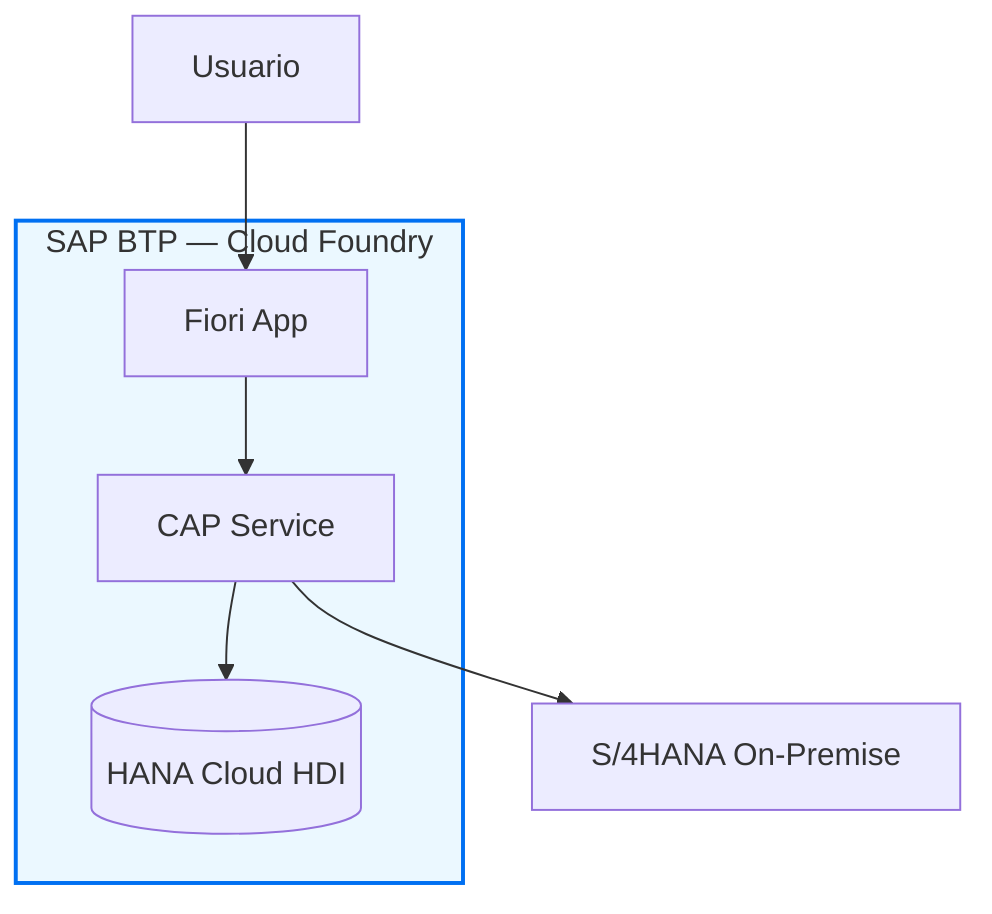

# Estructura maestra del documento de arquitectura

> Referencia del agente de documentación. Se lee bajo demanda.

Adapta y omite secciones según el stack detectado.

## PORTADA

```text
DOCUMENTO TÉCNICO SAP
━━━━━━━━━━━━━━━━━━━━━━━━━━━━━━━━━━━━━━
Proyecto     : [Nombre del proyecto]
Cliente      : [Empresa]
Versión      : 1.0.0
Fecha        : [YYYY-MM-DD]
Estado       : [Borrador / En revisión / Aprobado]
Clasificación: [Interno / Confidencial]
━━━━━━━━━━━━━━━━━━━━━━━━━━━━━━━━━━━━━━
Elaborado por: [Nombres]
Revisado por : [Nombre]
Aprobado por : [Nombre]
```

## 1. Resumen Ejecutivo

- Qué se construyó y por qué (máximo 1 página)
- Valor de negocio generado
- Componentes principales en lenguaje no técnico
- Fecha de go-live o estado actual

## 2. Contexto y Alcance

- Objetivos de negocio
- Tabla Scope In / Scope Out
- Sistemas y equipos involucrados
- Dependencias externas y prerequisitos

## 3. Arquitectura de Solución

Usar siempre diagramas Mermaid. Ejemplo:



> Adicionalmente, generar `.drawio` con componentes SAP BTP Horizon 2023.

- Descripción de cada componente
- Tabla de technology stack con versiones

| Componente | Tecnología | Versión | Runtime |
| --- | --- | --- | --- |
| Backend | SAP CAP Node.js | @sap/cds 9.x | Cloud Foundry |
| Base de datos | SAP HANA Cloud | [versión] | HDI |
| Frontend | SAP Fiori Elements | UI5 1.12x | BTP Work Zone |
| ABAP Layer | RAP + CDS ABAP | S/4HANA 2023 | On-Premise |

## 4. Arquitectura de Datos

### 4.1 Modelo de Dominio

Diagrama textual con entidades principales y relaciones clave.

### 4.2 CDS Schema (CAP)

```cds
// Entidades principales — schema.cds
namespace com.proyecto;

entity Orders : cuid, managed {
  status      : String(20) @assert.range enum { pending; approved; rejected; };
  amount      : Decimal(15,2);
  currency    : Currency;
  items       : Composition of many OrderItems on items.order = $self;
  toApprover  : Association to Users;
}
```

- Descripción de cada entidad y sus relaciones
- Campos clave y restricciones

### 4.3 HANA Cloud — HDI Containers _(si aplica)_

- Nombre del container HDI
- Artefactos desplegados (.hdbtable, .hdbview, .hdbcalculationview)
- Calculation Views y su propósito

## 5. Diseño Técnico Detallado

### 5.1 Capa de Servicios CAP _(si aplica)_

**Service Definition:**

```cds
// service.cds — nombre del servicio
@path: '/api/v1'
service OrdersService @(requires: 'authenticated-user') {
  entity Orders    as projection on db.Orders;
  action Approve(orderId : UUID) returns Orders;
}
```

**Event Handlers:**

Para cada handler documenta:

- Evento (BEFORE/ON/AFTER CREATE/READ/UPDATE/DELETE)
- Propósito
- Lógica principal (pseudocódigo o código real)
- Errores manejados

```javascript
// srv/orders-service.js
srv.before('CREATE', 'Orders', async (req) => {
  // Validación de negocio: amount > 0
  if (req.data.amount <= 0)
    req.error(400, 'El monto debe ser mayor a cero', 'amount');
});
```

**Acciones y Funciones:**

| Nombre | Tipo | Parámetros | Retorno | Descripción |
| --- | --- | --- | --- | --- |
| `Approve` | Action | `orderId: UUID` | `Orders` | Aprueba una orden y notifica al solicitante |

### 5.2 HANA Cloud — SQLScript _(si aplica)_

Para cada procedimiento o función tabla:

```sql
-- Nombre: PROC_CALC_AGING
-- Propósito: Calcula aging de cuentas por cobrar por períodos
-- Parámetros IN: IV_KEYDATE DATE
-- Parámetros OUT: ET_AGING (tabla resultado)
CREATE PROCEDURE PROC_CALC_AGING(
  IN  IV_KEYDATE DATE,
  OUT ET_AGING   AGING_T
)
LANGUAGE SQLSCRIPT AS
BEGIN
  -- lógica...
END;
```

### 5.3 ABAP / RAP _(SOLO si hay objetos ABAP en el proyecto)_

> **Si no hay ABAP**: documentar aquí únicamente qué APIs/BAPIs/IDocs del sistema
> ABAP se consumen desde la capa cloud (endpoints, autenticación, payload).

**RAP Business Object:**

```text
RAP BO: ZBO_PURCHASE_ORDER
├── CDS Interface View   : ZI_PurchaseOrder        (tabla EKKO/EKPO)
├── CDS Projection View  : ZC_PurchaseOrder         (provider contract)
├── Behavior Definition  : ZC_PURCHASEORDER.bdef    (managed, draft, approve)
├── Behavior Implementation: ZBP_C_PurchaseOrder
├── Access Control       : ZI_PurchaseOrder.dcl
└── Draft Table          : ZDRAFT_PURCHORD
```

**CDS Interface View:**

```abap
@AbapCatalog.sqlViewName: 'ZV_PURCHORD'
@AccessControl.authorizationCheck: #CHECK
@ObjectModel.resultSet.sizeCategory: #XL
define view entity ZI_PurchaseOrder
  as select from ekko as PO
  association [0..*] to ZI_PurchOrderItem as _Items
    on _Items.PurchaseOrder = PO.ebeln
{
  key PO.ebeln          as PurchaseOrder,
      PO.lifnr          as Vendor,
      PO.bedat          as OrderDate,
      -- campos adicionales...
      _Items
}
```

**Behavior Definition:**

Documenta: draft, actions, determinations, validations, side effects.

**Behavior Implementation — métodos clave:**

Para cada método documenta propósito, parámetros, lógica y mensajes de error.

**EML utilizado:**

```abap
" Ejemplo de EML en la implementación
MODIFY ENTITIES OF ZC_PurchaseOrder
  ENTITY PurchaseOrder
    EXECUTE Approve
      FROM VALUE #( ( %key-PurchaseOrder = iv_order_id
                      %param = VALUE #( ) ) )
  REPORTED DATA(lt_reported)
  FAILED  DATA(lt_failed).
```

**BAdIs implementados:**

| BAdI | Enhancement Spot | Método | Propósito |
| --- | --- | --- | --- |
| `BADI_MMPUR_PROCESS_PO` | `ES_MMPUR_PROCESS_PO` | `CHECK_PO` | Validación custom de OC |

**Objetos de desarrollo ABAP:**

| Tipo | Nombre | Descripción | Package | Transporte |
| --- | --- | --- | --- | --- |
| CDS View | `ZI_PurchaseOrder` | Interface View OC | `Z_MM_PO` | TR001 |
| BDEF | `ZC_PURCHASEORDER` | Behavior Definition | `Z_MM_PO` | TR001 |
| Clase | `ZBP_C_PurchaseOrder` | Handler RAP | `Z_MM_PO` | TR001 |

### 5.4 Arquitectura de Integración _(si aplica)_

**Inventario de interfaces:**

| ID | Nombre | Tipo | Origen | Destino | Frecuencia |
| --- | --- | --- | --- | --- | --- |
| IF-01 | Sincronización Clientes | OData V4 | S/4HANA | CAP | Real-time |
| IF-02 | Notificación aprobación | REST | CAP | Email service | On-event |

**Interface Specification (por cada iFlow / API):**

```text
IF-01: Sincronización de Clientes
━━━━━━━━━━━━━━━━━━━━━━━━━━━━━━━━━━━━━━━━━
Protocolo   : OData V4 / HTTPS
Endpoint    : /sap/opu/odata4/sap/api_business_partner/srvd_a2x/...
Autenticación: OAuth 2.0 (Client Credentials)
Trigger     : Real-time (POST /Customers)
Payload     : BusinessPartner entity
Error handling: Retry 3x con backoff exponencial
```

### 5.5 Frontend — Fiori / UI5 _(si aplica)_

**Inventario de aplicaciones:**

| App ID | Nombre | Tipo | OData service | Tile |
| --- | --- | --- | --- | --- |
| `ZMM_APPROVE_PO` | Aprobación de OC | Fiori Elements LR+OP | `ZC_PURCHASEORDER` | `mm-approve-po` |

**Configuración Launchpad:**

- Business Catalog, Business Group, Role asignado
- Parámetros de inicio

## 6. Seguridad y Autorizaciones

### 6.1 Modelo BTP / XSUAA _(si aplica)_

```json
// xs-security.json — scopes y roles definidos
{
  "xsappname": "proyecto-app",
  "scopes": [
    { "name": "$XSAPPNAME.read",    "description": "Lectura de datos" },
    { "name": "$XSAPPNAME.approve", "description": "Aprobar órdenes"  }
  ],
  "role-templates": [
    {
      "name": "Approver",
      "scope-references": ["$XSAPPNAME.approve", "$XSAPPNAME.read"]
    }
  ]
}
```

### 6.2 Roles ABAP / PFCG _(solo si hay ABAP)_

| Rol | Descripción | Transacciones | Objetos de autorización |
| --- | --- | --- | --- |
| `Z_MM_APPROVER` | Aprobador de OC | ME23N, ME29N | `M_BEST_BSA`, `M_BEST_EKO` |

## 7. Deployment y Operaciones

### 7.1 MTA — Módulos BTP _(si aplica)_

```yaml
# Estructura mta.yaml
modules:
  - name: proyecto-srv       # CAP service (Node.js)
  - name: proyecto-db        # HDI deployer
  - name: proyecto-approuter # Approuter (autenticación)
  - name: proyecto-ui        # Fiori app (HTML5 repo)
resources:
  - name: proyecto-xsuaa
  - name: proyecto-hana
  - name: proyecto-destination
```

### 7.2 Landscape

```text
DEV ──→ QAS ──→ PRD

BTP:   dev-subaccount → qa-subaccount → prd-subaccount
ABAP:  DEV (100)      → QAS (200)     → PRD (300)
```

### 7.3 Transportes ABAP _(solo si hay ABAP)_

| Transporte | Descripción | Objetos | Destino | Estado |
| --- | --- | --- | --- | --- |
| TR001 | RAP BO Inicial | CDS, BDEF, Clase | QAS | Liberado |

### 7.4 Monitoring

- Alertas configuradas (SAP Cloud ALM / Alert Notification Service)
- KPIs de operación
- Procedimiento ante fallos

## 8. Guía de Desarrollo Local

```bash
# Setup del proyecto para nuevos desarrolladores
git clone <repo-url>
cd proyecto
npm install
cds watch           # servidor local con SQLite

# Con HANA Cloud
cds deploy --to hana
cds watch --profile hybrid
```

- Convenciones de nombre del proyecto
- Estructura de branches (Gitflow / Trunk-based)
- Cómo correr tests unitarios

## 9. Glosario

Tabla de términos técnicos SAP y del dominio de negocio usados en el documento.

## Apéndices

### A. Inventario completo de objetos de desarrollo

Tabla exhaustiva: tipo, nombre, descripción, package, transporte.

### B. APIs y servicios externos consumidos

### C. Configuraciones de sistema requeridas

(Destinos BTP, parámetros de sistema ABAP, entorno Cloud Connector)

---
